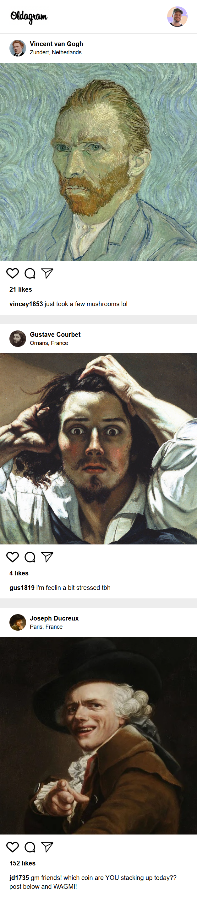

# 📸 Oldagram 

An **Instagram clone** that has posts dynamically rendered using JavaScript.
Double-click a post image or click the like button to increase likes.
Designed for **mobile view only**.

## 🖼️ Preview
🔗 Live Demo: https://scrimba-oldagram-rushdina.netlify.app/

<!--   -->

## 🛠️ Tech Stack
- `HTML`, `CSS`, `JavaScript`

## 📚 What I Learned 
- Rendering dynamic content with JS and template literals
- Structuring content with semantic HTML (`<article>`, `<figure>`, `<section>`, `<nav>`)
- Handling click and double-click events for interactive UI
- Updating DOM elements dynamically (likes counter)
- Using arrays of objects to store and manipulate data
- Adding accessibility features (ARIA labels)
- Formatting numbers with `toLocaleString()` for readability

## 💡 Future Improvements
- Add comment functionality
- Toggle like/unlike state
- Improve desktop responsiveness and styling
- Add a “time ago” timestamp for posts

## 🙌 Acknowledgements
- **Scrimba course:** [Scrimba Frontend Developer Career Path](https://scrimba.com/frontend-path-c0j)  
- **Design reference:** [Figma by Scrimba](https://www.figma.com/design/h0MKma9TTWzGOMQ9Ia6ROW/Oldagram?node-id=0-1&p=f&t=1VIJva7ESjCWB2UZ-0)
- **Image assets:** Provided by Scrimba

